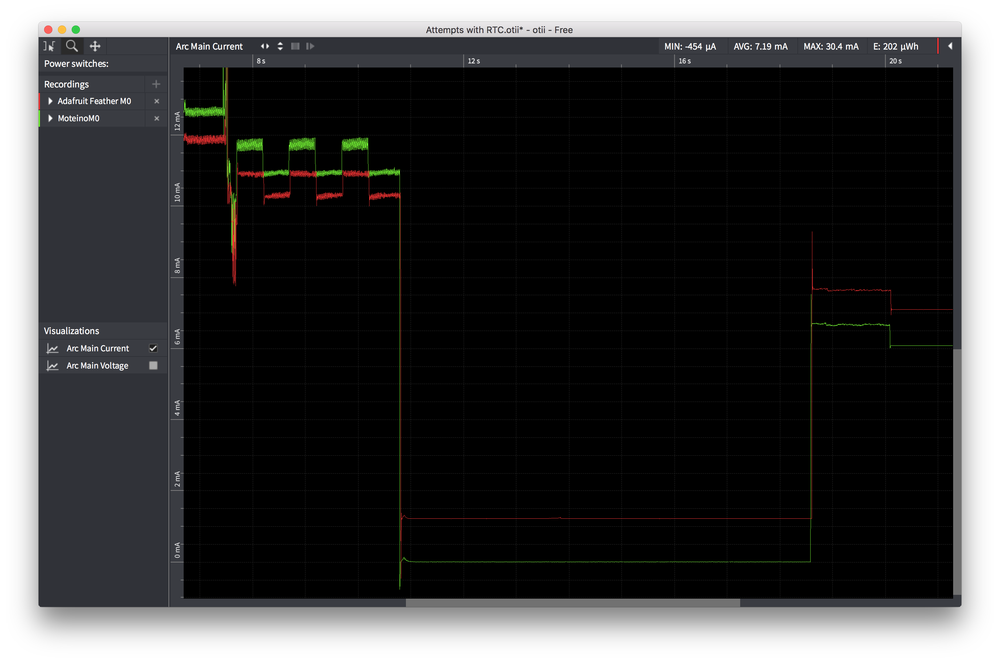
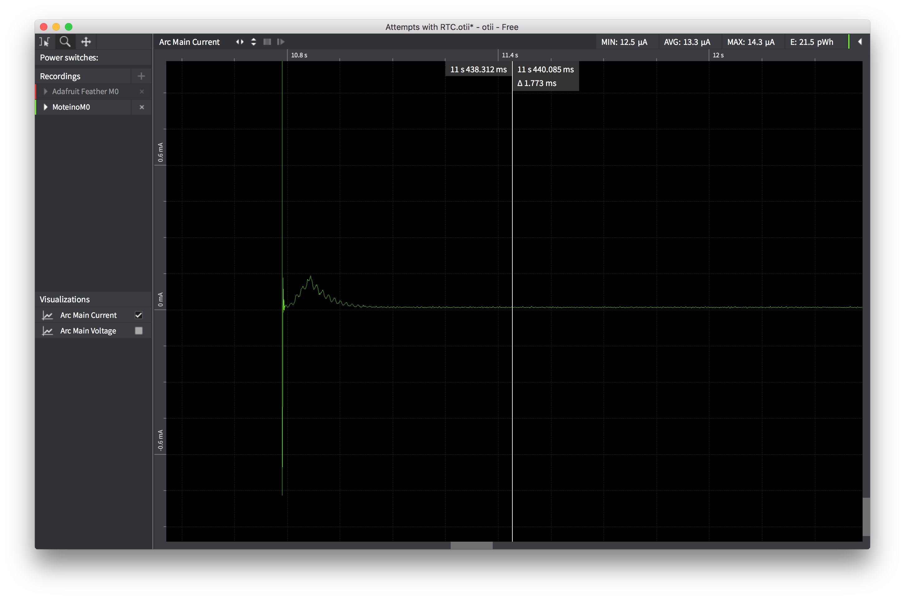

# Low Power LoRa Boards

This project is a place to capture information about the low power capabilities of readily
available microcontroller boards with LoRa radios.

## Power Profile #1 - How Low Can You Go?

### Setup
The first measurement scenario was to enter low power sleep with an RTC alarm set.

Using stock [Adafruit Feather M0 Lora](https://www.adafruit.com/product/3178) and
[LowPowerLab Moteino M0 with RFM95](https://lowpowerlab.com/guide/moteino/moteinom0/)
I ran the code and measured power consumption using a [Qoitech otii](https://www.qoitech.com/)
IoT power tool. The power leads were connected to each board via JST battery connector.

### Measurements
The results were that with the same code, the MoteinoM0 drew ~13µA whereas the Feather M0 drew 1.23mA.

Here's a screenshot of the OTII graph showing each board blinking 3 times and then going to sleep.
The Feather is in red and the Moteino is in green.

Here's a closeup of the MoteinoM0 low power state.

### Conclusion
The [MoteinoM0 guidance page](https://lowpowerlab.com/guide/moteino/moteinom0/) presents a sketch that purportedly puts the board to sleep with a 7µA sleep current. It actually draws something like 2.6mA because

1. It fails to set the LoRa SS line high before talking to Flash chip, so the flash chip never really gets put to sleep.
2. You need to turn off clocks and change pin settings in order to get down to the very low power states.

That said, once you have employed the code herein, it is absolutely possible to get a stock Moteino M0 with LoRa down to very low power state!

I haven't seen any claims of low power consumption for the Feather M0 LoRa. Perhaps it is possible to get below 1mA, but it will take further investigation.

## Power Profile #2

### Setup
This measurement scenario will be to power up, join TTN, sleep, then wake up and send a message.

(I'll have to wait to perform this test until I can borrow the OTII again.)

(to be continued...)
